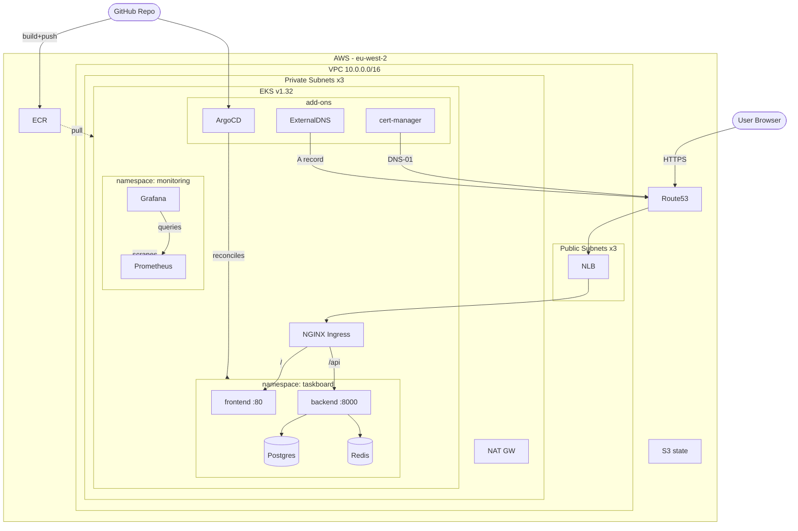

# taskboard-app-eks

A custom-built task manager app (**TaskBoard**) deployed on Amazon EKS following production-ready DevOps practices - Terraform IaC, ArgoCD GitOps, GitHub Actions CI/CD, Helm, cert-manager, ExternalDNS, and Prometheus + Grafana.

**URL (when deployed):** https://eks.labs.virtualscale.dev | **Region:** eu-west-2 | **EKS:** 1.32


---

## Table of contents

- [taskboard-app-eks](#taskboard-app-eks)
  - [Table of contents](#table-of-contents)
  - [Run locally](#run-locally)
  - [1. Stack](#1-stack)
  - [2. Key components](#2-key-components)
  - [3. Architecture](#3-architecture)
  - [4. Repository structure](#4-repository-structure)
  - [5. Prerequisites](#5-prerequisites)
  - [6. Deployment](#6-deployment)
    - [1 - Bootstrap](#1--bootstrap)
    - [2 - Infrastructure](#2--infrastructure)
    - [3 - Delegate DNS](#3--delegate-dns)
    - [4 - Connect kubectl](#4--connect-kubectl)
    - [5 - Install ArgoCD](#5--install-argocd)
    - [6 - Deploy everything via ArgoCD](#6--deploy-everything-via-argocd)
    - [7 - Apply ClusterIssuer (once cert-manager pods are Running)](#7--apply-clusterissuer-once-cert-manager-pods-are-running)
    - [8 - Apply Grafana secret](#8--apply-grafana-secret)
    - [9 - GitHub Actions secrets](#9--github-actions-secrets)
    - [10 - Push and verify](#10--push-and-verify)
  - [7. Manual vs automated](#7-manual-vs-automated)
  - [8. Application](#8-application)
  - [9. CI/CD pipelines](#9-cicd-pipelines)
  - [10. Monitoring](#10-monitoring)
  - [11. Useful commands](#11-useful-commands)
  - [12. Challenges and fixes](#12-challenges-and-fixes)
  - [13. Cost](#13-cost)
  - [14. Teardown](#14-teardown)

---

## Run locally

**Prerequisites:**
- [Docker Desktop](https://www.docker.com/products/docker-desktop/) installed and running
- [Node.js](https://nodejs.org/) >= 18 (first time only)
- Git

Run all commands from the **repo root** (`taskboard-app-eks/`).

```bash
# First time only - generate lock files
cd app/frontend && npm install && cd ../..
cd app/backend  && npm install && cd ../..

# Start all services
docker compose up --build
```

Services started:

| Service | URL |
|---|---|
| Frontend (React) | http://localhost:3001 |
| Backend API | http://localhost:8000/api/tasks |
| PostgreSQL | localhost:5432 |
| Redis | localhost:6379 |

**Useful local commands:**
```bash
docker compose ps                        # check container status
docker compose logs backend              # backend logs
docker compose logs frontend             # frontend/nginx logs
docker compose logs postgres             # database logs
docker compose restart backend           # restart a single service
docker compose down                      # stop and remove containers
docker compose down --volumes            # stop and wipe database
```

---

## 1. Stack

| Area | Technology |
|---|---|
| IaC | Terraform - modular (vpc, eks, irsa) + S3 remote state |
| Cluster | Amazon EKS 1.32, t3.medium nodes |
| Ingress + TLS | NGINX Ingress Controller + cert-manager (Let's Encrypt DNS-01) |
| DNS | ExternalDNS → Route53 |
| GitOps | ArgoCD (app-of-apps) |
| App packaging | Helm (`kubernetes/taskboard/`) |
| CI/CD | GitHub Actions - Terraform pipeline + App pipeline |
| Monitoring | kube-prometheus-stack (Prometheus + Grafana) |
| IAM | IRSA - scoped IAM role per service account |

---

## 2. Key components

### AWS Infrastructure (Terraform)
EKS cluster, VPC, IAM roles, ECR, and Route53 hosted zone provisioned via reusable Terraform modules (`vpc`, `eks`, `irsa`). State stored in S3 with native locking. Networking uses private subnets for EKS nodes and public subnets for the NLB. IAM roles are scoped per service account via IRSA — nodes never share a broad role.

### NGINX Ingress Controller
Deployed via Helm (ArgoCD). Provisions an AWS NLB, receives all inbound HTTPS traffic, and routes requests to services based on path (`/` → frontend, `/api` → backend). Terminates TLS using the certificate managed by cert-manager.

### cert-manager (SSL/TLS)
Installed via ArgoCD. Watches Ingress resources annotated with `letsencrypt-prod` ClusterIssuer, requests certificates from Let's Encrypt using DNS-01 challenge (creates a TXT record in Route53 to prove domain ownership), and renews them automatically before expiry.

### ExternalDNS (Dynamic DNS)
Deployed via ArgoCD. Watches Kubernetes Ingress and Service resources — when an Ingress hostname is created or updated, ExternalDNS automatically creates or updates the corresponding A record in Route53. No manual DNS changes needed after the initial NS delegation.

### ArgoCD (GitOps)
Runs inside the cluster. Continuously reconciles cluster state against this Git repo. When any manifest or Helm values file changes on `main`, ArgoCD detects the diff and applies it automatically. Git is the single source of truth — no manual `kubectl apply` for app changes.

### Helm
Used to package and deploy the TaskBoard app (`kubernetes/taskboard/`). Templates separate configuration (image tags, resource limits, hostnames) from Kubernetes manifests. The CI pipeline stamps the new image SHA into `values.yaml` on each build; ArgoCD picks up the diff and redeploys.

### CI/CD Pipelines (GitHub Actions)
Three pipelines: bootstrap (fmt + validate + Checkov), infrastructure (validate + Checkov + plan + apply), and app (Docker build + Trivy scan + ECR push + ArgoCD sync). All AWS authentication uses GitHub OIDC — no long-lived credentials stored.

### Checkov
Scans Terraform code for security misconfigurations before infrastructure is provisioned. Runs in the Terraform CI pipeline. Intentional skips are documented with justifications in `.checkov.yaml` per module.

### Trivy
Scans Docker images for CVEs before they are pushed to ECR. Fails the pipeline on CRITICAL or HIGH severity vulnerabilities.

### Monitoring (Prometheus + Grafana)
kube-prometheus-stack deployed via ArgoCD. Prometheus scrapes metrics from all cluster workloads and nodes. Grafana pre-loaded with dashboards for node CPU/memory, pod health, and NGINX Ingress traffic. Prometheus data retained for 7 days on a 5Gi EBS volume.

### IRSA (IAM Roles for Service Accounts)
Each service account (cert-manager, ExternalDNS) gets its own scoped IAM role instead of sharing the broad node role. Implemented via a reusable `terraform/modules/irsa/` module using EKS OIDC federation.

---

## 3. Architecture



**DNS structure:**
```
virtualscale.dev                    → Cloudflare (untouched)
  └── labs.virtualscale.dev         → delegated to Route53
        └── eks.labs.virtualscale.dev  → A record by ExternalDNS → NLB
```

---

## 4. Repository structure

```
app/
  frontend/           # React + Vite (Dockerfile, nginx.conf, src/)
  backend/            # Node.js + Express (Dockerfile, src/)
docker-compose.yml    # Local dev
terraform/
  bootstrap/          # S3 state bucket
  infrastructure/     # VPC, EKS, IRSA, ECR, DNS, GitHub OIDC
  modules/vpc|eks|irsa/
kubernetes/
  taskboard/          # Helm chart
  argocd/apps/        # ArgoCD Application manifests
  argocd/values/      # Helm values for third-party charts
  certmanager/        # ClusterIssuer
  monitoring/         # Grafana secret (gitignored)
.github/workflows/
  terraform-bootstrap.yml
  terraform.yml
  app.yml
```

---

## 5. Prerequisites

| Tool | Version |
|---|---|
| Terraform | >= 1.10 |
| AWS CLI | v2 |
| kubectl | >= 1.28 |
| Docker Desktop | latest |

AWS: IAM permissions for EC2, EKS, IAM, S3, Route53, ECR.
DNS: A domain where you can add NS records.

---

## 6. Deployment

### 1 - Bootstrap

```bash
cd terraform/bootstrap && terraform init && terraform apply
```

### 2 - Infrastructure

```bash
cd terraform/infrastructure && terraform init && terraform apply
terraform output   # note the outputs
```

### 3 - Delegate DNS

Add NS records in your registrar for `labs.<your-domain>` pointing to the 4 name servers from `terraform output name_servers`.

### 4 - Connect kubectl

```bash
aws eks update-kubeconfig --region eu-west-2 --name taskboard-app-eks-prod
kubectl get nodes
```

### 5 - Install ArgoCD

```bash
kubectl create namespace argocd
kubectl apply -n argocd -f https://raw.githubusercontent.com/argoproj/argo-cd/stable/manifests/install.yaml
kubectl wait --for=condition=available deployment/argocd-server -n argocd --timeout=180s
```

### 6 - Deploy everything via ArgoCD

```bash
kubectl apply -f kubernetes/argocd/apps/
```

### 7 - Apply ClusterIssuer (once cert-manager pods are Running)

```bash
kubectl get pods -n cert-manager
kubectl apply -f kubernetes/certmanager/cluster-issuer.yaml
```

### 8 - Apply Grafana secret

Edit `kubernetes/monitoring/grafana-admin-secret.yaml` with your password (file is gitignored), then:

```bash
kubectl apply -f kubernetes/monitoring/grafana-admin-secret.yaml
```

### 9 - GitHub Actions secrets

Go to **Settings → Secrets and variables → Actions**:

| Secret | Source |
|---|---|
| `AWS_TERRAFORM_ROLE_ARN` | `terraform output github_terraform_role_arn` |
| `AWS_CICD_ROLE_ARN` | `terraform output github_cicd_role_arn` |
| `ECR_REGISTRY` | `<account-id>.dkr.ecr.eu-west-2.amazonaws.com` |
| `ARGOCD_SERVER` | ArgoCD external hostname |
| `ARGOCD_TOKEN` | Generate below |

**ArgoCD API token:**

```bash
# Port-forward in one terminal
kubectl port-forward svc/argocd-server -n argocd 8080:443

# Get password
kubectl -n argocd get secret argocd-initial-admin-secret -o jsonpath="{.data.password}" | base64 -d

# Windows: download CLI
curl -sSL -o argocd.exe https://github.com/argoproj/argo-cd/releases/latest/download/argocd-windows-amd64.exe

# Enable API key capability
kubectl patch configmap argocd-cm -n argocd --type merge -p '{"data": {"accounts.admin": "apiKey, login"}}'

# Login and generate token
./argocd.exe login localhost:8080 --username admin --password <password> --insecure
./argocd.exe account generate-token --account admin
```

### 10 - Push and verify

```bash
git push origin main
kubectl get pods -n taskboard
kubectl get certificate -n taskboard   # READY = True
curl -I https://eks.labs.virtualscale.dev
```

---

## 7. Manual vs automated

**Always manual:**
- NS records at your registrar (external to AWS)
- GitHub Actions secrets (can't be committed)
- ClusterIssuer (cert-manager CRDs must exist first)
- Grafana admin secret (credentials - gitignored)
- ArgoCD API token (requires running cluster)

**Automated on every push:**
- `terraform/**` → Terraform validate + Checkov + plan + apply
- `app/**` or `kubernetes/**` → Docker build + Trivy + ECR push + ArgoCD sync
- Ingress changes → ExternalDNS updates Route53
- Ingress TLS annotation → cert-manager requests/renews certificate

---

## 8. Application

TaskBoard: create, complete, and delete tasks.

| Service | Tech | Port |
|---|---|---|
| Frontend | React + Vite + nginx | 80 |
| Backend | Node.js + Express | 8000 |
| Database | PostgreSQL 15 | 5432 |
| Cache | Redis 7 (60s TTL) | 6379 |


---

## 9. CI/CD pipelines

**terraform-bootstrap.yml** - fmt + validate + Checkov on `terraform/bootstrap/**`. No apply.

**terraform.yml** - fmt + validate + Checkov + plan + apply on `terraform/infrastructure/**`.

**app.yml** - on `app/**` or `kubernetes/**`:
1. Docker build (tagged with `$GITHUB_SHA`)
2. Trivy scan - fails on CRITICAL/HIGH
3. Push to ECR
4. Update image tags in `kubernetes/taskboard/values.yaml`
5. `git commit + push`
6. `argocd app sync` + `argocd app wait --timeout 120`

All AWS auth uses GitHub OIDC - no stored credentials.

---

## 10. Monitoring

```bash
kubectl port-forward svc/monitoring-grafana -n monitoring 3000:80
# http://127.0.0.1:3000 - user: admin
```

Pre-loaded dashboards:

| Dashboard | ID | Shows |
|---|---|---|
| Kubernetes Cluster | 7249 | Node CPU/memory, pod counts |
| Kubernetes Pods | 6417 | Per-pod CPU/memory, restarts |
| NGINX Ingress | 9614 | Request rate, latency, errors |

---

## 11. Useful commands

**Cluster health**
```bash
kubectl get nodes -o wide                          # node status, IPs, instance type
kubectl get pods -A                                # all pods across all namespaces
kubectl top nodes                                  # CPU/memory per node
kubectl top pods -n taskboard                      # CPU/memory per app pod
```

**App**
```bash
kubectl get pods -n taskboard                      # app pod status
kubectl logs -n taskboard -l app=backend --tail=30
kubectl logs -n taskboard -l app=frontend --tail=30
kubectl exec -it -n taskboard <pod> -- sh          # shell into a running pod
kubectl get ingress -n taskboard                   # ingress hostname + address
curl -I https://eks.labs.virtualscale.dev          # end-to-end HTTPS check
```

**ArgoCD**
```bash
kubectl get applications -n argocd                 # sync status of all apps
kubectl describe application <name> -n argocd | tail -30
# Force resync if stuck
kubectl annotate application taskboard -n argocd argocd.argoproj.io/refresh=hard --overwrite
```

**TLS / cert-manager**
```bash
kubectl get certificate -n taskboard               # READY = True means cert is valid
kubectl describe certificate taskboard-tls -n taskboard
kubectl logs -n cert-manager deployment/cert-manager --tail=30
```

**DNS / ExternalDNS**
```bash
kubectl logs -n external-dns -l app.kubernetes.io/name=external-dns --tail=30
dig eks.labs.virtualscale.dev                      # verify DNS resolves
```

**Monitoring**
```bash
kubectl get pods -n monitoring                     # prometheus + grafana status
kubectl port-forward svc/monitoring-grafana -n monitoring 3000:80
# then open http://127.0.0.1:3000
```

**Scale nodes**
```bash
aws eks update-nodegroup-config \
  --cluster-name taskboard-app-eks-prod \
  --nodegroup-name taskboard-app-eks-prod-nodes \
  --scaling-config minSize=1,maxSize=2,desiredSize=2 \
  --region eu-west-2
```

---

## 12. Challenges and fixes

**NLB stuck in `<pending>`**
VPC subnets were tagged with the wrong cluster name (`taskboard-app-eks` vs `taskboard-app-eks-prod`). The EKS cloud controller couldn't find matching subnets. Fixed `cluster_name = "${var.project_name}-${var.environment}"` in `infrastructure/main.tf`.

**All pods `Pending` - too many pods**
`t3.medium` has a 17-pod limit (VPC CNI assigns a real IP per pod). Node was full with system pods before app pods could schedule. Fixed by scaling to 2 nodes.

**postgres `CrashLoopBackOff`**
EBS volumes have a `lost+found` dir at the root. PostgreSQL refuses to start if the data directory isn't empty. Fixed with `subPath: postgres` on the volumeMount.

**cert-manager `AccessDenied` on Route53**
IRSA trust policy had `system:serviceaccounts:` (plural). Kubernetes tokens use `system:serviceaccount:` (singular). AWS STS never matched. Fixed the typo in `terraform/modules/irsa/main.tf`.

**Prometheus PVC `Pending`**
EKS doesn't install the EBS CSI driver by default - no StorageClass provisioner available. Fixed by installing `aws-ebs-csi-driver` as a managed add-on (now in Terraform).

**Docker build - `requires 1 argument`**
`ECR_REGISTRY` secret had a trailing newline. GitHub expands secrets inline so the newline split the command. Fixed by re-saving the secret and quoting all `${{ env.* }}` expansions.

**Trivy failing on npm internals**
`node:20-alpine` bundles npm's own copy of `tar` which had CVEs. Not a runtime concern. Fixed with `skip-dirs: /usr/local/lib/node_modules/npm`.

**db-migrate `ENOTFOUND postgres`**
Hook was `pre-install` - ran before postgres was deployed. Changed to `post-install,post-upgrade`.

**ExternalDNS `ImagePullBackOff`**
Bitnami chart pulls from Docker Hub which rate-limits EKS nodes. Switched to `kubernetes-sigs/external-dns` chart.

---

## 13. Cost

| Resource | Monthly |
|---|---|
| EKS control plane | ~$73 |
| 2 × t3.medium nodes | ~$60 |
| NAT Gateway | ~$35 |
| EBS (2 × 5Gi gp2) | ~$1 |
| Route53 | ~$0.50 |
| **Total** | **~$170** |

Scale to 1 node when not in use: ~$110/month.

---

## 14. Teardown

Run in this order to avoid dependency errors.

**1. Delete ArgoCD apps** (removes all cluster resources)
```bash
kubectl delete -f kubernetes/argocd/apps/
kubectl get ns   # wait until app namespaces are gone
```

**2. Check for leftover load balancers** (will block VPC deletion)
```bash
aws elb describe-load-balancers --region eu-west-2 --query 'LoadBalancerDescriptions[*].LoadBalancerName'
aws elbv2 describe-load-balancers --region eu-west-2 --query 'LoadBalancers[*].LoadBalancerArn'
```
Delete any that remain manually.

**3. Clear Route53 records**
In the Route53 console, delete all records in the hosted zone except `NS` and `SOA`. Terraform can't delete the zone while records exist.

**4. Force-delete ECR repos**
```bash
aws ecr delete-repository --repository-name taskboard-app-eks/frontend --force --region eu-west-2
aws ecr delete-repository --repository-name taskboard-app-eks/backend --force --region eu-west-2
```

**5. Destroy infrastructure**
```bash
cd terraform/infrastructure && terraform destroy
```
If stuck on VPC, delete leftover security groups:
```bash
aws ec2 describe-security-groups --filters "Name=vpc-id,Values=<vpc-id>" \
  --query 'SecurityGroups[?GroupName!=`default`].GroupId' --region eu-west-2
aws ec2 delete-security-group --group-id <sg-id> --region eu-west-2
```

**6. Destroy bootstrap**

`prevent_destroy = true` is set on the S3 bucket. Comment it out in `terraform/bootstrap/main.tf` before destroying:

```hcl
# lifecycle {
#   prevent_destroy = true
# }
```

Clear the bucket before destroying (versioning is enabled - both versions and delete markers must be removed):

```bash
# Delete all versions (skip if output is None - bucket has no versions)
aws s3api delete-objects \
  --bucket taskboard-app-eks-terraform-state \
  --delete "$(aws s3api list-object-versions \
    --bucket taskboard-app-eks-terraform-state \
    --query '{Objects: Versions[].{Key:Key,VersionId:VersionId}}' \
    --output json)"

# Delete all delete markers
aws s3api delete-objects \
  --bucket taskboard-app-eks-terraform-state \
  --delete "$(aws s3api list-object-versions \
    --bucket taskboard-app-eks-terraform-state \
    --query '{Objects: DeleteMarkers[].{Key:Key,VersionId:VersionId}}' \
    --output json)"
```

Then destroy:
```bash
cd terraform/bootstrap && terraform destroy
```

**7. Remove NS records from your registrar**
Delete the `labs.virtualscale.dev` NS records from Cloudflare.
