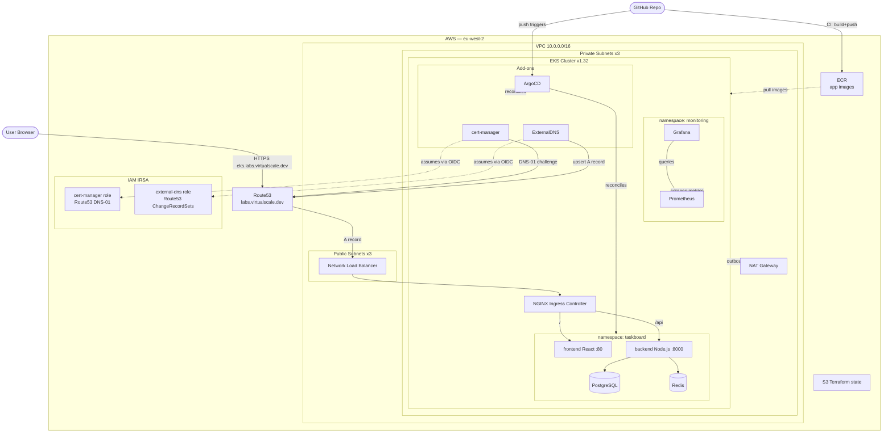

# taskboard-app-eks

Production-grade DevOps project: deploy a secure cloud-native task manager (**TaskBoard**) on Amazon EKS using Terraform IaC, ArgoCD GitOps, GitHub Actions CI/CD, Helm, cert-manager TLS, ExternalDNS, and Prometheus + Grafana monitoring.

**Live URL:** https://eks.labs.virtualscale.dev
**AWS Region:** eu-west-2 | **EKS Version:** 1.32

---

## Table of contents

1. [Project overview](#1-project-overview)
2. [Key components](#2-key-components)
3. [Architecture](#3-architecture)
4. [Repository structure](#4-repository-structure)
5. [Prerequisites](#5-prerequisites)
6. [Deployment guide](#6-deployment-guide)
7. [Manual vs automated](#7-manual-vs-automated)
8. [Application — TaskBoard](#8-application--taskboard)
9. [CI/CD pipelines](#9-cicd-pipelines)
10. [Monitoring](#10-monitoring)
11. [Troubleshooting](#11-troubleshooting)
12. [Challenges and fixes](#12-challenges-and-fixes)
13. [Cost estimate](#13-cost-estimate)

---

## 1. Project overview

| Deliverable | Technology |
|---|---|
| Infrastructure as Code | Terraform (modular: vpc, eks, irsa) + S3 remote state |
| Kubernetes cluster | Amazon EKS 1.32, t3.medium nodes |
| Ingress + TLS | NGINX Ingress Controller + cert-manager (Let's Encrypt DNS-01) |
| DNS automation | ExternalDNS → Route53 |
| GitOps | ArgoCD (app-of-apps pattern) |
| App packaging | Helm chart (`kubernetes/taskboard/`) |
| CI/CD pipeline 1 | GitHub Actions: Terraform validate → Checkov → plan → apply |
| CI/CD pipeline 2 | GitHub Actions: Docker build → Trivy scan → ECR push → ArgoCD sync |
| Monitoring | kube-prometheus-stack (Prometheus + Grafana) |
| IAM security | IRSA — each service account has its own scoped IAM role |

---

## 2. Key components

### NGINX Ingress Controller
Acts as the single entry point into the cluster. Receives traffic from the NLB, routes HTTP/HTTPS requests to the correct service based on path (`/` → frontend, `/api` → backend), and terminates TLS using the certificate managed by cert-manager.

### cert-manager (TLS management)
Automates TLS certificate lifecycle. Watches Ingress resources annotated with a `ClusterIssuer`, requests certificates from Let's Encrypt using the DNS-01 ACME challenge (creates a TXT record in Route53 to prove domain ownership), and renews them automatically before expiry.

### ExternalDNS (dynamic DNS)
Watches Kubernetes Ingress and Service resources. When an Ingress with a hostname is created, ExternalDNS automatically creates the corresponding A record in Route53 pointing to the NLB. No manual DNS changes needed after the initial NS delegation.

### ArgoCD (GitOps)
Runs inside the cluster and continuously reconciles cluster state against this Git repository. When a manifest or Helm values file changes on `main`, ArgoCD detects the diff and applies it automatically. Git is the single source of truth — no manual `kubectl apply` needed for app changes.

### Helm
Kubernetes package manager used to template and deploy the TaskBoard app (`kubernetes/taskboard/`). Values (image tags, resource limits, hostnames) are separated from templates — the CI pipeline stamps new image tags into `values.yaml` on each build, which ArgoCD picks up as a diff and redeploys.

### Checkov (Terraform security scanning)
Static analysis tool that scans Terraform code for security misconfigurations before infrastructure is provisioned. Runs in the Terraform CI pipeline and fails the build if unaccepted risks are found. Per-module `.checkov.yaml` files document intentional skip decisions with justifications.

### Trivy (container image scanning)
Scans Docker images for known CVEs before they are pushed to ECR. Runs in the app CI pipeline after the build step. The pipeline fails on `CRITICAL` or `HIGH` severity vulnerabilities to prevent insecure images from reaching the cluster.

### IRSA (IAM Roles for Service Accounts)
By default all pods on a node share the node's IAM role. IRSA fixes this by assigning a dedicated, scoped IAM role to each Kubernetes service account. cert-manager gets only Route53 DNS-01 permissions; ExternalDNS gets only Route53 record management. Implemented via a reusable `terraform/modules/irsa/` module.

---

## 3. Architecture



**DNS delegation structure:**
```
virtualscale.dev              → root domain at Cloudflare (untouched)
  └── labs.virtualscale.dev       → delegated to Route53 via NS records
        └── eks.labs.virtualscale.dev  → A record auto-created by ExternalDNS → NLB
```

---

## 4. Repository structure

```
app/
  frontend/             # React + Vite (Dockerfile, nginx.conf, src/)
  backend/              # Node.js + Express (Dockerfile, src/)
docker-compose.yml      # Local dev environment
terraform/
  bootstrap/            # S3 state bucket — apply once
  infrastructure/       # VPC + EKS + IRSA + ECR + DNS + GitHub OIDC
  modules/
    vpc/                # VPC, 3 public + 3 private subnets, IGW, NAT GW
    eks/                # EKS cluster, node group, OIDC provider, EBS CSI add-on
    irsa/               # Reusable IAM role for Kubernetes service accounts
kubernetes/
  taskboard/            # TaskBoard Helm chart (Chart.yaml, values.yaml, templates/)
  argocd/
    apps/               # ArgoCD Application resources (one per component)
    values/             # Helm values for third-party charts (nginx, cert-manager, etc.)
  certmanager/          # ClusterIssuer (applied once after cert-manager is running)
  monitoring/           # Grafana admin secret (gitignored — apply manually)
docs/
  architecture.png      # Architecture diagram
.github/workflows/
  terraform-bootstrap.yml  # Bootstrap pipeline (fmt + validate + Checkov)
  terraform.yml            # Infrastructure pipeline (validate + Checkov + plan + apply)
  app.yml                  # App pipeline (build + Trivy + ECR push + ArgoCD sync)
```

---

## 5. Prerequisites

| Tool | Version | Purpose |
|---|---|---|
| Terraform | >= 1.10 | IaC (requires S3 native locking) |
| AWS CLI | v2 | Interact with AWS |
| kubectl | >= 1.28 | Manage Kubernetes resources |
| Docker Desktop | latest | Build and push images locally |
| Git + Git Bash | any | Version control |

**AWS requirements:** IAM permissions for EC2, EKS, IAM, S3, Route53, ECR.
**DNS requirement:** A registered domain with a registrar you can add NS records to.

---

## 6. Deployment guide

### Step 1 — Bootstrap: create Terraform state bucket

```bash
cd terraform/bootstrap
terraform init
terraform apply
```

Creates: S3 bucket with versioning, encryption, and native locking.

### Step 2 — Provision infrastructure

```bash
cd terraform/infrastructure
terraform init
terraform apply
```

Creates: VPC, EKS cluster, Route53 hosted zone, IRSA roles, ECR repos, GitHub OIDC provider, GitHub Actions IAM roles.

After apply, note the outputs — you will need them in the next steps:

```bash
terraform output
```

### Step 3 — Delegate DNS to Route53

In your DNS registrar (e.g. Cloudflare), add four NS records for your subdomain pointing to the name servers from `terraform output name_servers`:

```
labs.virtualscale.dev  NS  ns-xxxx.awsdns-xx.org
labs.virtualscale.dev  NS  ns-xxxx.awsdns-xx.co.uk
labs.virtualscale.dev  NS  ns-xxxx.awsdns-xx.com
labs.virtualscale.dev  NS  ns-xxxx.awsdns-xx.net
```

### Step 4 — Connect kubectl to EKS

```bash
aws eks update-kubeconfig --region eu-west-2 --name taskboard-app-eks-prod
kubectl get nodes   # verify nodes in Ready state
```

### Step 5 — Install ArgoCD

```bash
kubectl create namespace argocd
kubectl apply -n argocd -f https://raw.githubusercontent.com/argoproj/argo-cd/stable/manifests/install.yaml
kubectl wait --for=condition=available deployment/argocd-server -n argocd --timeout=180s
```

### Step 6 — Apply ArgoCD Applications

```bash
kubectl apply -f kubernetes/argocd/apps/
```

ArgoCD will deploy: ingress-nginx, cert-manager, external-dns, taskboard, monitoring.

### Step 7 — Apply ClusterIssuer (after cert-manager is Running)

```bash
kubectl get pods -n cert-manager   # wait until all Running
kubectl apply -f kubernetes/certmanager/cluster-issuer.yaml
```

### Step 8 — Apply Grafana admin secret (before monitoring starts)

```bash
# Edit the file and set your real password first:
# kubernetes/monitoring/grafana-admin-secret.yaml  (gitignored)
kubectl apply -f kubernetes/monitoring/grafana-admin-secret.yaml
```

### Step 9 — Configure GitHub Actions secrets

Go to **Settings → Secrets and variables → Actions** and add:

| Secret | Value |
|---|---|
| `AWS_TERRAFORM_ROLE_ARN` | From `terraform output github_terraform_role_arn` |
| `AWS_CICD_ROLE_ARN` | From `terraform output github_cicd_role_arn` |
| `ECR_REGISTRY` | `<account-id>.dkr.ecr.eu-west-2.amazonaws.com` |
| `ARGOCD_SERVER` | ArgoCD external hostname |
| `ARGOCD_TOKEN` | ArgoCD API token (see below) |

**Generate ArgoCD API token:**

```bash
# Port-forward (keep open)
kubectl port-forward svc/argocd-server -n argocd 8080:443

# Get initial admin password
kubectl -n argocd get secret argocd-initial-admin-secret \
  -o jsonpath="{.data.password}" | base64 -d

# Download CLI (Windows)
curl -sSL -o argocd.exe \
  https://github.com/argoproj/argo-cd/releases/latest/download/argocd-windows-amd64.exe

# Enable apiKey capability
kubectl patch configmap argocd-cm -n argocd \
  --type merge -p '{"data": {"accounts.admin": "apiKey, login"}}'

# Login and generate token
./argocd.exe login localhost:8080 --username admin --password <password> --insecure
./argocd.exe account generate-token --account admin
```

### Step 10 — Push to GitHub

```bash
git push origin main
```

The CI pipeline builds and pushes images to ECR. ArgoCD syncs the cluster. After a few minutes:

```bash
kubectl get pods -n taskboard          # all Running / Completed
kubectl get certificate -n taskboard   # READY = True
curl -I https://eks.labs.virtualscale.dev  # HTTP/2 200
```

---

## 7. Manual vs automated

### Always manual

| Step | Why |
|---|---|
| Add NS records at DNS registrar | Registrar is external to AWS — no Terraform integration |
| Set GitHub Actions secrets | Cannot be committed to the repo |
| Apply ClusterIssuer | cert-manager CRDs must exist first |
| Apply Grafana admin secret | Contains credentials — gitignored by design |
| Generate ArgoCD API token | Requires a running cluster and ArgoCD UI interaction |

### Fully automated on every `git push`

| Trigger | What happens automatically |
|---|---|
| Push to `terraform/infrastructure/**` | Terraform validate → Checkov → plan → apply |
| Push to `app/**` or `kubernetes/**` | Docker build → Trivy scan → ECR push → image tag update → ArgoCD sync |
| Any push | ArgoCD reconciles cluster state from Git |
| Ingress created/updated | ExternalDNS creates/updates Route53 A record |
| Ingress annotated with ClusterIssuer | cert-manager requests and auto-renews TLS certificate |

---

## 8. Application — TaskBoard

A simple task manager (create / complete / delete tasks):

| Component | Technology | Port |
|---|---|---|
| Frontend | React + Vite, served by nginx | 80 |
| Backend | Node.js + Express REST API | 8000 |
| Database | PostgreSQL 15 (auto-migrated on deploy) | 5432 |
| Cache | Redis 7 (60s cache on `GET /api/tasks`) | 6379 |

**Local development:**

```bash
docker compose up --build
# Open http://localhost:3000
```

**Helm chart (`kubernetes/taskboard/`):**

| File | Purpose |
|---|---|
| `Chart.yaml` | Chart metadata |
| `values.yaml` | All configurable values (image tags updated by CI) |
| `templates/frontend.yaml` | Deployment + Service |
| `templates/backend.yaml` | Deployment + Service |
| `templates/postgres.yaml` | PVC (5Gi gp2) + Deployment + Service |
| `templates/redis.yaml` | Deployment + Service |
| `templates/secret.yaml` | POSTGRES_PASSWORD secret |
| `templates/ingress.yaml` | NGINX Ingress with TLS |
| `templates/db-migrate.yaml` | Post-install Job — runs migrations after postgres is up |

---

## 9. CI/CD pipelines

### Pipeline 1 — Terraform bootstrap (`.github/workflows/terraform-bootstrap.yml`)

Triggers on changes to `terraform/bootstrap/**`. Runs fmt check, validate, and Checkov scan. No apply — bootstrap is applied manually once.

### Pipeline 2 — Terraform infrastructure (`.github/workflows/terraform.yml`)

Triggers on changes to `terraform/infrastructure/**` or `terraform/modules/**`.

| Step | What it does |
|---|---|
| `terraform fmt -check` | Fails if unformatted |
| `terraform validate` | Validates HCL syntax |
| Checkov scan | Security misconfiguration scan (skips documented in `.checkov.yaml`) |
| `terraform plan` | Shows what will change |
| `terraform apply` | Applies on push to `main` |

### Pipeline 3 — App (`.github/workflows/app.yml`)

Triggers on changes to `app/**`, `kubernetes/**`, or `charts/**`.

| Step | What it does |
|---|---|
| Docker build | Builds frontend + backend images tagged with `${{ github.sha }}` |
| Trivy scan | Fails on CRITICAL/HIGH CVEs; `skip-dirs` excludes npm internals |
| ECR push | Pushes `:<sha>` and `:latest` tags |
| Update image tags | `sed` stamps new SHA into `kubernetes/taskboard/values.yaml` |
| `git commit + push` | Commits updated values (ArgoCD detects diff) |
| ArgoCD sync + wait | `argocd app sync` then `argocd app wait --timeout 120` |

**Authentication:** Both AWS pipelines use GitHub OIDC — no long-lived credentials stored.

---

## 10. Monitoring

**Access Grafana:**

```bash
kubectl port-forward svc/monitoring-grafana -n monitoring 3000:80
# Open http://127.0.0.1:3000 — username: admin
```

**Pre-loaded dashboards:**

| Dashboard | Grafana ID | Shows |
|---|---|---|
| Kubernetes Cluster | 7249 | Node CPU, memory, pod counts |
| Kubernetes Pods | 6417 | Per-pod CPU/memory, restarts |
| NGINX Ingress | 9614 | Request rate, latency, error rate |

Prometheus retention: 7 days on a 5Gi EBS `gp2` volume.

---

## 11. Troubleshooting

```bash
# Cluster health
kubectl get nodes && kubectl get pods -A

# ArgoCD sync status
kubectl get applications -n argocd
kubectl describe application <name> -n argocd | tail -30

# TLS certificate
kubectl get certificate -n taskboard
kubectl describe certificate taskboard-tls -n taskboard

# cert-manager logs
kubectl logs -n cert-manager deployment/cert-manager --tail=30

# ExternalDNS logs
kubectl logs -n external-dns -l app.kubernetes.io/name=external-dns --tail=30

# App logs
kubectl logs -n taskboard -l app=backend --tail=30
kubectl logs -n taskboard -l app=frontend --tail=30

# Force ArgoCD resync
kubectl patch application taskboard -n argocd --type merge -p '{"operation": null}'
kubectl annotate application taskboard -n argocd argocd.argoproj.io/refresh=hard --overwrite

# Scale nodes up/down
aws eks update-nodegroup-config \
  --cluster-name taskboard-app-eks-prod \
  --nodegroup-name taskboard-app-eks-prod-nodes \
  --scaling-config minSize=1,maxSize=2,desiredSize=2 \
  --region eu-west-2
```

---

## 12. Challenges and fixes

### NLB stuck in `<pending>` — wrong subnet tags

**Symptom:** `ingress-nginx-controller` service `EXTERNAL-IP` stayed `<pending>` for hours.
**Root cause:** The VPC module was passing `cluster_name = var.project_name` (`taskboard-app-eks`) instead of `"${var.project_name}-${var.environment}"` (`taskboard-app-eks-prod`). The EKS CCM looks for subnets tagged `kubernetes.io/cluster/<cluster-name>: shared` — the mismatch meant no subnets matched and no ELB was provisioned.
**Fix:** Corrected the variable in `infrastructure/main.tf`. Manually added the correct tags to existing subnets to unblock immediately.

---

### All pods `Pending` — node pod limit reached

**Symptom:** Pods couldn't be scheduled despite low CPU/memory usage. Error: `Too many pods`.
**Root cause:** `t3.medium` has a hard pod limit of 17 (EKS VPC CNI assigns a real VPC IP per pod; limit = ENIs × IPs per ENI). With ArgoCD + kube-system + add-ons, the node was full before app pods could schedule.
**Fix:** Scaled to 2 nodes temporarily. Long-term: enable prefix delegation on the VPC CNI to raise the limit to 110 without adding nodes.

---

### postgres `CrashLoopBackOff` — `lost+found` in data directory

**Symptom:** postgres pod crashed immediately after PVC was provisioned.
**Root cause:** EBS volumes are formatted with ext4, which creates a `lost+found` directory at the root. PostgreSQL refuses to initialise a data directory that is not empty.
**Fix:** Added `subPath: postgres` to the volumeMount so postgres data goes into a subdirectory, bypassing `lost+found`.

---

### cert-manager `AccessDenied` on Route53 — IRSA trust policy typo

**Symptom:** DNS-01 challenges failed with `AccessDenied` despite IRSA being configured.
**Root cause:** The IRSA module had `system:serviceaccounts:` (plural) in the `sub` condition. Kubernetes OIDC tokens use `system:serviceaccount:` (singular). AWS STS never matched the condition and rejected all `AssumeRoleWithWebIdentity` calls.
**Fix:** Corrected the typo in `terraform/modules/irsa/main.tf` and ran `terraform apply`.

---

### Prometheus PVC `Pending` — missing EBS CSI driver

**Symptom:** Prometheus pod stayed `Pending`; PVC had no storage class.
**Root cause:** EKS does not install the EBS CSI driver by default. Without it no `gp2` StorageClass provisioner exists and PVCs remain unbound.
**Fix:** Attached `AmazonEBSCSIDriverPolicy` to the node role and installed `aws-ebs-csi-driver` as a managed EKS add-on. Added it to the EKS Terraform module so it provisions automatically going forward.

---

### Docker build failing — trailing newline in ECR_REGISTRY secret

**Symptom:** `docker buildx build requires 1 argument`.
**Root cause:** The `ECR_REGISTRY` GitHub secret had a trailing newline. GitHub expands secrets before the shell sees them, so the newline was injected literally into the command, splitting the `-t` argument.
**Fix:** Re-saved the secret without the trailing newline. Quoted all `${{ env.* }}` expansions in the workflow.

---

### Trivy scan failing on npm internal CVEs

**Symptom:** Trivy flagged HIGH CVEs in `npm/node_modules/tar` inside the backend image.
**Root cause:** The `node:20-alpine` base image bundles npm with its own copy of `tar`. These are npm's internal tools — never invoked at runtime.
**Fix:** Added `skip-dirs: /usr/local/lib/node_modules/npm` to the Trivy scan step.

---

### db-migrate hook failing — postgres not yet running

**Symptom:** `db-migrate` pod failed with `ENOTFOUND postgres`.
**Root cause:** `db-migrate` was a `pre-install` hook — it ran before any other resources (including postgres) were deployed.
**Fix:** Changed the hook to `post-install,post-upgrade` so it runs after postgres is up.

---

### LoadBalancer image pull — ExternalDNS `ImagePullBackOff`

**Symptom:** ExternalDNS pod stuck in `ImagePullBackOff` pulling from Docker Hub.
**Root cause:** Docker Hub enforces rate limits on anonymous pulls from shared EKS node IPs. The Bitnami chart pulls from `docker.io/bitnami/external-dns`.
**Fix:** Switched to the official `kubernetes-sigs/external-dns` chart which pulls from a registry without rate limits.

---

## 13. Cost estimate (eu-west-2, approx.)

| Resource | Monthly |
|---|---|
| EKS control plane | ~$73 |
| 2 × t3.medium nodes | ~$60 |
| NAT Gateway | ~$35 |
| EBS volumes (2 × 5Gi gp2) | ~$1 |
| Route53 hosted zone | ~$0.50 |
| **Total** | **~$170/month** |

Scale to 1 node when not in use (~$110/month). Destroy everything when done:

```bash
cd terraform/infrastructure && terraform destroy
cd terraform/bootstrap     && terraform destroy
```
