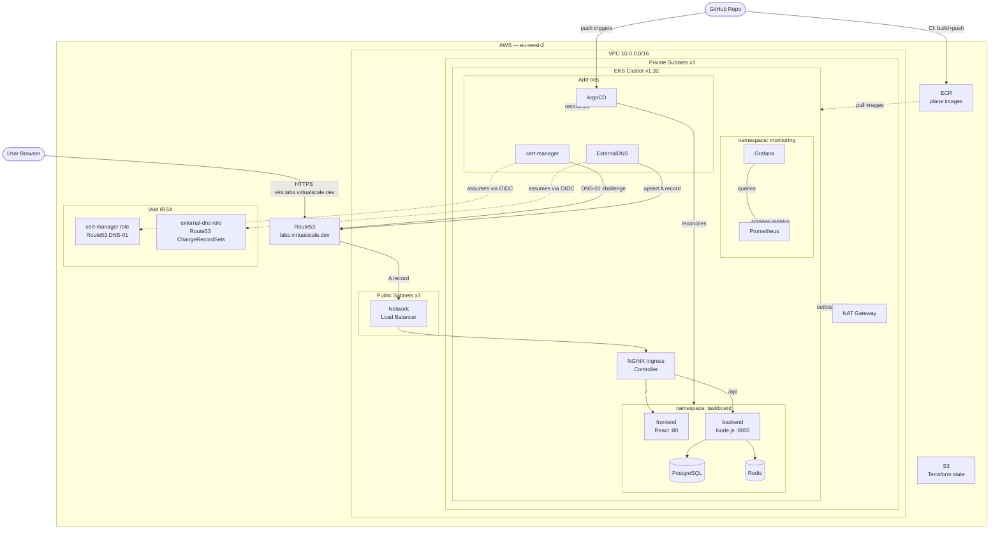

# plane-app-aws-eks

Production-grade DevOps assignment: deploy a secure cloud-native task manager (**TaskBoard**) on Amazon EKS using Terraform IaC, ArgoCD GitOps, GitHub Actions CI/CD, cert-manager TLS, ExternalDNS, and Prometheus + Grafana monitoring.

**Live URL:** https://eks.labs.virtualscale.dev
**AWS Region:** eu-west-2
**EKS Version:** 1.32

---

## Table of contents

1. [Project overview](#1-project-overview)
2. [Architecture](#2-architecture)
3. [Repository structure](#3-repository-structure)
4. [Prerequisites](#4-prerequisites)
5. [Deployment guide (reproduce from scratch)](#5-deployment-guide-reproduce-from-scratch)
6. [What is manual vs automated](#6-what-is-manual-vs-automated)
7. [Application — TaskBoard](#7-application--taskboard)
8. [CI/CD pipelines](#8-cicd-pipelines)
9. [Monitoring](#9-monitoring)
10. [Troubleshooting commands](#10-troubleshooting-commands)
11. [Known issues and fixes](#11-known-issues-and-fixes)

---

## 1. Project overview

### What was built

| Deliverable | Technology |
|---|---|
| Infrastructure as Code | Terraform (modular: vpc, eks, irsa, dns) |
| Remote state | S3 + native locking (`use_lockfile = true`, Terraform ≥1.10) |
| Kubernetes cluster | Amazon EKS 1.32 on t3.medium nodes |
| Ingress + TLS | NGINX Ingress Controller + cert-manager (Let's Encrypt DNS-01) |
| DNS automation | ExternalDNS → Route53 |
| GitOps | ArgoCD (app-of-apps pattern) |
| CI/CD pipeline 1 | GitHub Actions: Terraform validate → Checkov scan → plan → apply |
| CI/CD pipeline 2 | GitHub Actions: Docker build → Trivy scan → ECR push → ArgoCD sync |
| Monitoring | kube-prometheus-stack (Prometheus + Grafana) |
| IAM security | IRSA — every Kubernetes service account has its own scoped IAM role |

### Application

TaskBoard is a simple task manager (create / complete / delete tasks):

- **Frontend:** React + Vite, served by nginx on port 80
- **Backend:** Node.js + Express REST API on port 8000
- **Database:** PostgreSQL 15 (auto-migrated on startup via db-migrate Job)
- **Cache:** Redis 7 (caches `GET /api/tasks` for 60 s, invalidated on writes)

---

## 2. Architecture



Full diagram with component descriptions: [docs/architecture.md](docs/architecture.md)

---

## 3. Repository structure

```
app/
  frontend/             # React + Vite source (src/App.jsx, vite.config.js)
  backend/              # Node.js + Express source (src/index.js, routes/tasks.js)
docker/
  Dockerfile.frontend   # Multi-stage: Node build → nginx serve
  Dockerfile.backend    # Node.js production image
  nginx.conf            # nginx config (React Router + /api proxy)
  docker-compose.yml    # Local dev environment
terraform/
  bootstrap/            # S3 state bucket (apply once, never again)
  infrastructure/       # Main infra: VPC + EKS + DNS + IRSA + ECR
  modules/
    vpc/                # VPC, 3 public + 3 private subnets, IGW, NAT GW, route tables
    eks/                # EKS cluster, managed node group, OIDC provider, EBS CSI add-on
    irsa/               # Reusable IAM role for Kubernetes service accounts
    dns/                # Route53 hosted zone
kubernetes/
  app/                  # TaskBoard manifests (namespace: taskboard)
  argocd/               # ArgoCD Applications (app-of-apps)
  certmanager/          # ClusterIssuer (Let's Encrypt DNS-01)
docs/
  architecture.md       # Full Mermaid architecture diagram
.github/workflows/
  terraform.yml         # Terraform CI/CD pipeline
  app.yml               # App build + deploy pipeline
```

---

## 4. Prerequisites

| Tool | Version | Purpose |
|---|---|---|
| Terraform | >= 1.10 | IaC provisioning (requires S3 native locking) |
| AWS CLI | v2 | Interact with AWS |
| kubectl | >= 1.28 | Manage Kubernetes resources |
| Docker Desktop | latest | Build and push images locally |
| Git + Git Bash | any | Version control (Windows users: use Git Bash) |

**AWS account requirements:**

- IAM user or role with permissions for: EC2, EKS, IAM, S3, Route53, ECR
- A registered domain with DNS you can delegate (this project uses `virtualscale.dev` via Cloudflare)

---

## 5. Deployment guide (reproduce from scratch)

### Step 0 — Bootstrap: create Terraform state bucket

```bash
cd terraform/bootstrap
terraform init
terraform apply
# Creates: S3 bucket with versioning + encryption + native locking
```

### Step 1 — Provision infrastructure

```bash
cd terraform/infrastructure
terraform init
terraform apply
# Creates: VPC, EKS cluster, Route53 hosted zone, IRSA roles, ECR repos,
#          GitHub OIDC provider, GitHub Actions IAM roles
```

Copy the outputs and fill in the Kubernetes manifests:

| Output | File | Field |
|---|---|---|
| `cert_manager_role_arn` | `kubernetes/argocd/apps/cert-manager.yaml` | `eks.amazonaws.com/role-arn` |
| `external_dns_role_arn` | `kubernetes/argocd/apps/external-dns.yaml` | `eks.amazonaws.com/role-arn` |
| `ecr_frontend_url`:latest | `kubernetes/app/plane-web.yaml` | `image:` |
| `ecr_backend_url`:latest | `kubernetes/app/plane-api.yaml` | `image:` |
| `name_servers` (all 4) | DNS registrar | NS records for your subdomain |

### Step 2 — Delegate DNS to Route53

**Why two subdomains?**

The app is reachable at `eks.labs.virtualscale.dev`, which follows a deliberate two-level pattern:

```
virtualscale.dev              → root domain, stays at Cloudflare
  └── labs.virtualscale.dev       → delegated to Route53 via NS records in Cloudflare
        └── eks.labs.virtualscale.dev  → A record auto-created by ExternalDNS → NLB
```

Rather than moving the entire root domain to Route53, only the `labs.` subdomain is delegated. This keeps your root domain and any other records (email, other sites) untouched at Cloudflare, while giving Route53 full ownership of `labs.virtualscale.dev` and everything under it. ExternalDNS and cert-manager can then create and manage records in that zone autonomously — no manual DNS changes needed after the initial delegation.

`labs` acts as an environment namespace — you could add more entries under it (e.g. `dev.labs.`, `staging.labs.`, a second cluster at `eks2.labs.`) all managed automatically.

In your DNS registrar (e.g. Cloudflare), add NS records for your subdomain pointing to the 4 AWS name servers from `terraform output name_servers`:

```
labs.virtualscale.dev  NS  ns-xxxx.awsdns-xx.org
labs.virtualscale.dev  NS  ns-xxxx.awsdns-xx.co.uk
labs.virtualscale.dev  NS  ns-xxxx.awsdns-xx.com
labs.virtualscale.dev  NS  ns-xxxx.awsdns-xx.net
```

### Step 3 — Connect kubectl to EKS

```bash
aws eks update-kubeconfig --region eu-west-2 --name plane-app-eks-prod
kubectl get nodes   # verify nodes in Ready state
```

### Step 4 — Install ArgoCD

```bash
kubectl create namespace argocd
kubectl apply -n argocd -f https://raw.githubusercontent.com/argoproj/argo-cd/stable/manifests/install.yaml
kubectl wait --for=condition=available deployment/argocd-server -n argocd --timeout=180s
```

### Step 5 — Apply ArgoCD Applications + ClusterIssuer

```bash
kubectl apply -f kubernetes/argocd/apps/
kubectl apply -f kubernetes/certmanager/cluster-issuer.yaml
```

ArgoCD will deploy: ingress-nginx, cert-manager, external-dns, taskboard, monitoring.

> The EBS CSI driver is now provisioned automatically by Terraform (`aws_eks_addon` in the EKS module). No manual step required.

### Step 6 — Configure GitHub Actions secrets

Go to **Settings → Secrets and variables → Actions** in your GitHub repo and add:

| Secret | Value |
|---|---|
| `AWS_TERRAFORM_ROLE_ARN` | From `terraform output github_terraform_role_arn` |
| `AWS_CICD_ROLE_ARN` | From `terraform output github_cicd_role_arn` |
| `ECR_REGISTRY` | `<account-id>.dkr.ecr.eu-west-2.amazonaws.com` |
| `ARGOCD_SERVER` | ArgoCD external hostname |
| `ARGOCD_TOKEN` | ArgoCD API token (see below) |

#### Generate ArgoCD API token (Windows Git Bash)

```bash
# Port-forward to ArgoCD (keep this terminal open)
kubectl port-forward svc/argocd-server -n argocd 8080:443

# In a new terminal — get the initial admin password
kubectl -n argocd get secret argocd-initial-admin-secret \
  -o jsonpath="{.data.password}" | base64 -d

# Download the CLI binary (Windows)
curl -sSL -o argocd.exe \
  https://github.com/argoproj/argo-cd/releases/latest/download/argocd-windows-amd64.exe

# Login
./argocd.exe login localhost:8080 --username admin --password <password> --insecure

# Enable apiKey capability (required before token generation)
kubectl patch configmap argocd-cm -n argocd \
  --type merge \
  -p '{"data": {"accounts.admin": "apiKey, login"}}'

# Generate token
./argocd.exe account generate-token --account admin
```

### Step 7 — Build and push Docker images

```bash
# Verify Docker is running
docker info

# Authenticate to ECR
aws ecr get-login-password --region eu-west-2 | \
  docker login --username AWS --password-stdin \
  207137402976.dkr.ecr.eu-west-2.amazonaws.com

# Build and push frontend
docker build -f docker/Dockerfile.frontend \
  -t 207137402976.dkr.ecr.eu-west-2.amazonaws.com/plane-app-eks/plane-frontend:latest .
docker push 207137402976.dkr.ecr.eu-west-2.amazonaws.com/plane-app-eks/plane-frontend:latest

# Build and push backend
docker build -f docker/Dockerfile.backend \
  -t 207137402976.dkr.ecr.eu-west-2.amazonaws.com/plane-app-eks/plane-backend:latest .
docker push 207137402976.dkr.ecr.eu-west-2.amazonaws.com/plane-app-eks/plane-backend:latest
```

### Step 8 — Push to GitHub and verify

```bash
git push origin main
```

ArgoCD detects the push and syncs the taskboard namespace. After a few minutes:

```bash
kubectl get pods -n taskboard          # all Running / Completed
kubectl get certificate -n taskboard   # READY = True
kubectl get ingress -n taskboard       # ADDRESS populated
curl -I https://eks.labs.virtualscale.dev  # HTTP/2 200
```

---

## 6. What is manual vs automated

### Always manual (irreducible)

These steps cannot be automated — they require human action regardless of how much of the rest is scripted.

| Step | Why it cannot be automated |
|---|---|
| Add NS records at your DNS registrar (e.g. Cloudflare) | Your registrar is external to AWS — Terraform has no API integration with it |
| Set GitHub Actions secrets in the repo | Secrets cannot be committed to the repo; must be set in GitHub UI |
| Generate the ArgoCD API token | Requires a running cluster, a browser login to ArgoCD, and patching `argocd-cm` |

### Currently manual but could be moved to Terraform

These steps were performed manually during this project but are straightforward to automate with additional Terraform resources.

| Step | How to automate |
|---|---|
| Register GitHub OIDC provider in AWS IAM | Add `aws_iam_openid_connect_provider` resource to `infrastructure/main.tf` |
| Create `github-actions-terraform` and `github-actions-cicd` IAM roles | Add `aws_iam_role` resources to `infrastructure/main.tf` and expose ARNs as outputs |
| Install EBS CSI driver (`aws eks create-addon`) | Add `aws_eks_addon` resource to the EKS module (already called out in Issue 1 prevention) |

### Currently manual but could be scripted

These steps are one-liners that could be bundled into a bootstrap shell script run once after `terraform apply`.

| Step | Command |
|---|---|
| Connect kubectl to EKS | `aws eks update-kubeconfig --region eu-west-2 --name plane-app-eks-prod` |
| Install ArgoCD | `kubectl apply -n argocd -f https://raw.githubusercontent.com/argoproj/argo-cd/stable/manifests/install.yaml` |
| Enable ArgoCD `apiKey` capability | `kubectl patch configmap argocd-cm -n argocd --type merge -p '{"data": {"accounts.admin": "apiKey, login"}}'` |
| Apply ArgoCD Applications + ClusterIssuer | `kubectl apply -f kubernetes/argocd/apps/ && kubectl apply -f kubernetes/certmanager/cluster-issuer.yaml` |

### Fully automated on every `git push`

| Trigger | What runs automatically |
|---|---|
| Push to `terraform/**` | Terraform fmt check → validate → Checkov security scan → plan → apply |
| Push to `app/**`, `docker/**`, `kubernetes/app/**` | Docker build → Trivy CVE scan → ECR push → K8s manifest image tag update → ArgoCD sync |
| Any push | ArgoCD continuously reconciles cluster state from Git |
| Ingress created/updated | ExternalDNS automatically creates/updates Route53 DNS records |
| Ingress annotated with ClusterIssuer | cert-manager automatically requests and renews TLS certificates from Let's Encrypt |

### One-time local prerequisite

| Step | When needed |
|---|---|
| Run `npm install` in `app/frontend` and `app/backend` to generate `package-lock.json` | Only on a fresh machine where lock files are not yet present — both files are committed to the repo so cloning is sufficient |

---

## 7. Application — TaskBoard

### Local development

```bash
docker compose -f docker/docker-compose.yml up --build
# Open http://localhost:3000
```

### Kubernetes manifests (`kubernetes/app/`)

| File | Resource |
|---|---|
| `namespace.yaml` | `taskboard` namespace |
| `secret.yaml` | `taskboard-secret` (POSTGRES_PASSWORD — dev only, base64-encoded) |
| `configmap.yaml` | `taskboard-config` (DB connection string, Redis URL) |
| `postgres.yaml` | PVC (5Gi gp2) + Deployment + Service |
| `redis.yaml` | Deployment + Service |
| `plane-api.yaml` | Backend Deployment + Service |
| `plane-web.yaml` | Frontend Deployment + Service |
| `plane-worker.yaml` | db-migrate Job (runs on every deploy) |
| `ingress.yaml` | NGINX Ingress with TLS at `eks.labs.virtualscale.dev` |

### Security notes

- `secret.yaml` contains a base64-encoded password committed to the repo. This is acceptable for a self-training project — in production, use AWS Secrets Manager or External Secrets Operator.
- Grafana admin password is stored in plain text in `kubernetes/argocd/apps/monitoring.yaml`. In production, use a Kubernetes Secret or SOPS encryption.

---

## 8. CI/CD pipelines

### Pipeline 1 — Terraform (`.github/workflows/terraform.yml`)

Triggered on push to `main` when files under `terraform/` change.

| Step | What it does |
|---|---|
| `terraform fmt -check` | Fails if code is not formatted |
| `terraform validate` | Validates HCL syntax |
| Checkov scan | Scans Terraform for security misconfigurations |
| `terraform plan` | Shows what will change |
| `terraform apply` | Applies changes (uses GitHub OIDC, no stored credentials) |

### Pipeline 2 — App (`.github/workflows/app.yml`)

Triggered on push to `main` when files under `app/`, `docker/`, or `kubernetes/app/` change.

| Step | What it does |
|---|---|
| Docker build frontend + backend | Builds images tagged with `${{ github.sha }}` |
| Trivy scan (CRITICAL + HIGH) | Fails pipeline if critical or high CVEs found |
| ECR push | Pushes both `:latest` and `:<sha>` tags |
| Update image tags in manifests | `sed` replaces `:latest` in K8s manifests with the new SHA |
| `git commit + push` | Commits updated manifests (triggers ArgoCD diff) |
| ArgoCD sync + wait | Calls `argocd app sync taskboard` then `argocd app wait taskboard --timeout 120` via API token |

### Authentication

Both pipelines use **GitHub OIDC** — no long-lived AWS credentials are stored. GitHub requests a short-lived JWT, which is exchanged for AWS temporary credentials via `sts:AssumeRoleWithWebIdentity`.

---

## 9. Monitoring

### Access Grafana

```bash
kubectl port-forward svc/kube-prometheus-stack-grafana -n monitoring 3000:80
# Open http://127.0.0.1:3000/login
# Username: admin
# Password: (set in kubernetes/argocd/apps/monitoring.yaml)
```

### Pre-loaded dashboards

| Dashboard | Grafana ID | Shows |
|---|---|---|
| Kubernetes Cluster | 7249 | Node CPU, memory, pod counts |
| Kubernetes Pods | 6417 | Per-pod CPU/memory, restarts |
| NGINX Ingress | 9614 | Request rate, latency, error rate |

### Prometheus retention

7 days, stored on a 5Gi EBS `gp2` volume (`storageClassName: gp2` required explicitly on EKS).

---

## 10. Troubleshooting commands

```bash
# Cluster health
kubectl get nodes
kubectl get pods -A
kubectl top nodes
kubectl top pods -A

# ArgoCD sync status
kubectl get applications -n argocd

# Ingress and TLS
kubectl get ingress -n taskboard
kubectl get certificate -n taskboard
kubectl describe certificate taskboard-tls -n taskboard
kubectl describe certificaterequest -n taskboard

# cert-manager ACME logs
kubectl logs -n cert-manager -l app=cert-manager --tail=50

# ExternalDNS logs
kubectl logs -n external-dns -l app.kubernetes.io/name=external-dns --tail=50

# NGINX Ingress logs
kubectl logs -n ingress-nginx -l app.kubernetes.io/name=ingress-nginx --tail=50

# Taskboard pods
kubectl get pods -n taskboard
kubectl logs -n taskboard -l app=backend --tail=50
kubectl logs -n taskboard -l app=frontend --tail=50
kubectl logs -n taskboard -l app=postgres --tail=50

# PVC status
kubectl get pvc -A

# Verify subnet tags (needed for NLB provisioning)
aws ec2 describe-subnets \
  --subnet-ids subnet-0e23e1d2780d4ece7 subnet-0cedea7f1c22439de subnet-0f5cdfde400ffbc6f \
  --query 'Subnets[*].Tags[?starts_with(Key, `kubernetes.io`)]' \
  --region eu-west-2

# Scale nodes up (for testing)
aws eks update-nodegroup-config \
  --cluster-name plane-app-eks-prod \
  --nodegroup-name plane-app-eks-prod-nodes \
  --scaling-config minSize=1,maxSize=2,desiredSize=2 \
  --region eu-west-2

# Scale nodes down (to save cost)
aws eks update-nodegroup-config \
  --cluster-name plane-app-eks-prod \
  --nodegroup-name plane-app-eks-prod-nodes \
  --scaling-config minSize=1,maxSize=2,desiredSize=1 \
  --region eu-west-2

# Test app
curl -I https://eks.labs.virtualscale.dev
```

---

## 11. Known issues and fixes

A full log of all issues encountered during this project is in [CLAUDE.md](CLAUDE.md#issues-encountered-and-resolved). Key highlights:

| # | Issue | Root cause | Fix |
|---|---|---|---|
| 6 | NLB stuck in `<pending>` | VPC subnet tags had wrong cluster name | Fixed `cluster_name = "${var.project_name}-${var.environment}"` in `main.tf` |
| 7 | All pods `Pending` — too many pods | t3.medium hard limit: 17 pods | Scaled to 2 nodes |
| 10 | postgres PVC `Pending` | No `storageClassName` in PVC spec | Added `storageClassName: gp2` to `postgres.yaml` |
| 11 | postgres `CrashLoopBackOff` | EBS `lost+found` in data dir | Added `subPath: postgres` to volumeMount |
| 12 | cert-manager `AccessDenied` on Route53 | IRSA trust policy had `serviceaccounts` (plural) | Fixed to `serviceaccount` (singular) in `irsa/main.tf` |
| 13 | Prometheus PVC `Pending` | Missing `storageClassName` in Helm values | Added `storageClassName: gp2` to `monitoring.yaml`, deleted StatefulSet + PVC |

---

## Cost estimate (eu-west-2, approx.)

| Resource | Monthly cost |
|---|---|
| EKS control plane | ~$73 |
| 2 x t3.medium nodes | ~$60 |
| NAT Gateway | ~$35 |
| EBS volumes (2 x 5Gi gp2) | ~$1 |
| Route53 hosted zone | ~$0.50 |
| **Total** | **~$170/month** |

Scale to 1 node when not testing (~$110/month). Destroy everything when done:

```bash
cd terraform/infrastructure && terraform destroy
cd terraform/bootstrap    && terraform destroy
```
