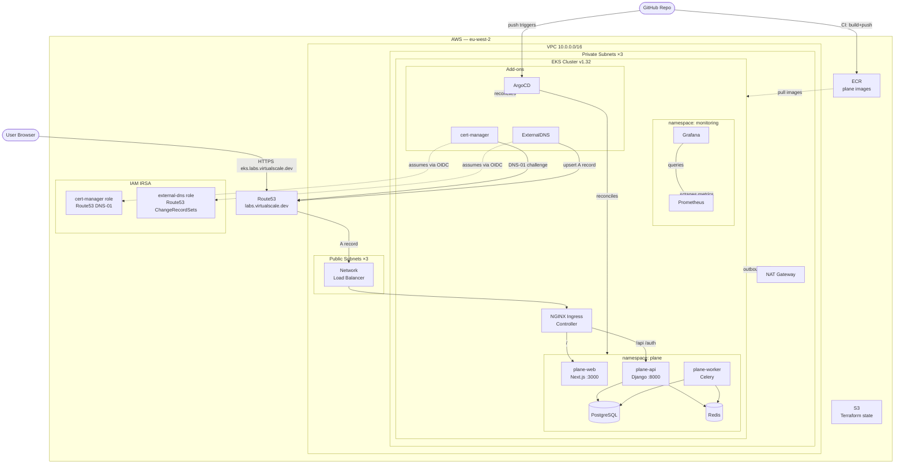

# Architecture Diagram

## Component responsibilities

| Component | What it does |
|---|---|
| **Route53** | Authoritative DNS for `labs.virtualscale.dev` |
| **NLB** | AWS Network Load Balancer provisioned by NGINX Ingress; entry point for all HTTPS traffic |
| **NGINX Ingress** | Terminates TLS, routes requests to plane-web or plane-api by path |
| **cert-manager** | Requests and renews Let's Encrypt TLS certificates via Route53 DNS-01 challenge |
| **ExternalDNS** | Watches Ingress resources and creates/updates Route53 A records automatically |
| **ArgoCD** | GitOps controller — syncs cluster state from this Git repo on every push |
| **Prometheus** | Scrapes metrics from all cluster workloads and nodes |
| **Grafana** | Dashboards for CPU/memory, pod health, node status, and Ingress traffic |
| **IRSA** | Grants cert-manager and ExternalDNS scoped Route53 access via Kubernetes OIDC tokens |
| **ECR** | Private image registry; CI pipeline pushes versioned Plane images here |
| **S3** | Remote Terraform state backend with native locking (`use_lockfile = true`) |
